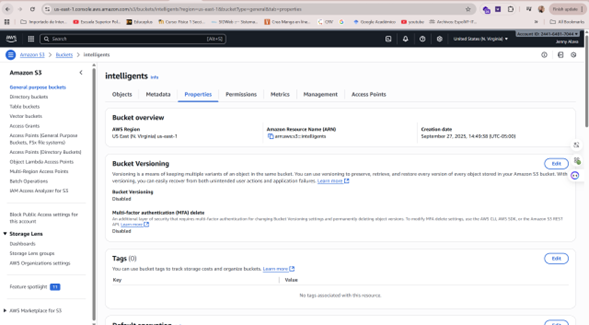
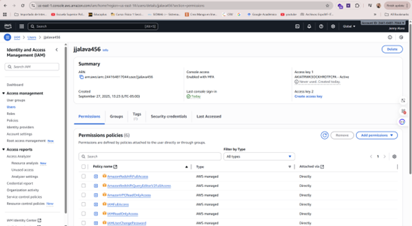
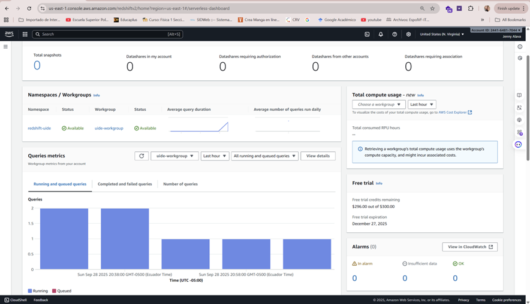
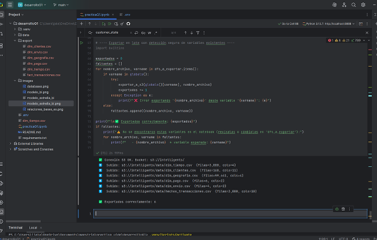
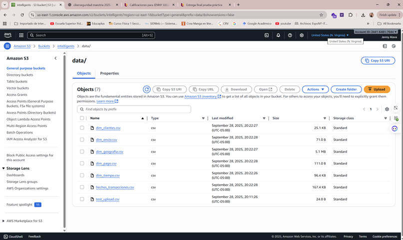
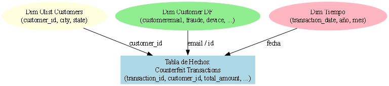
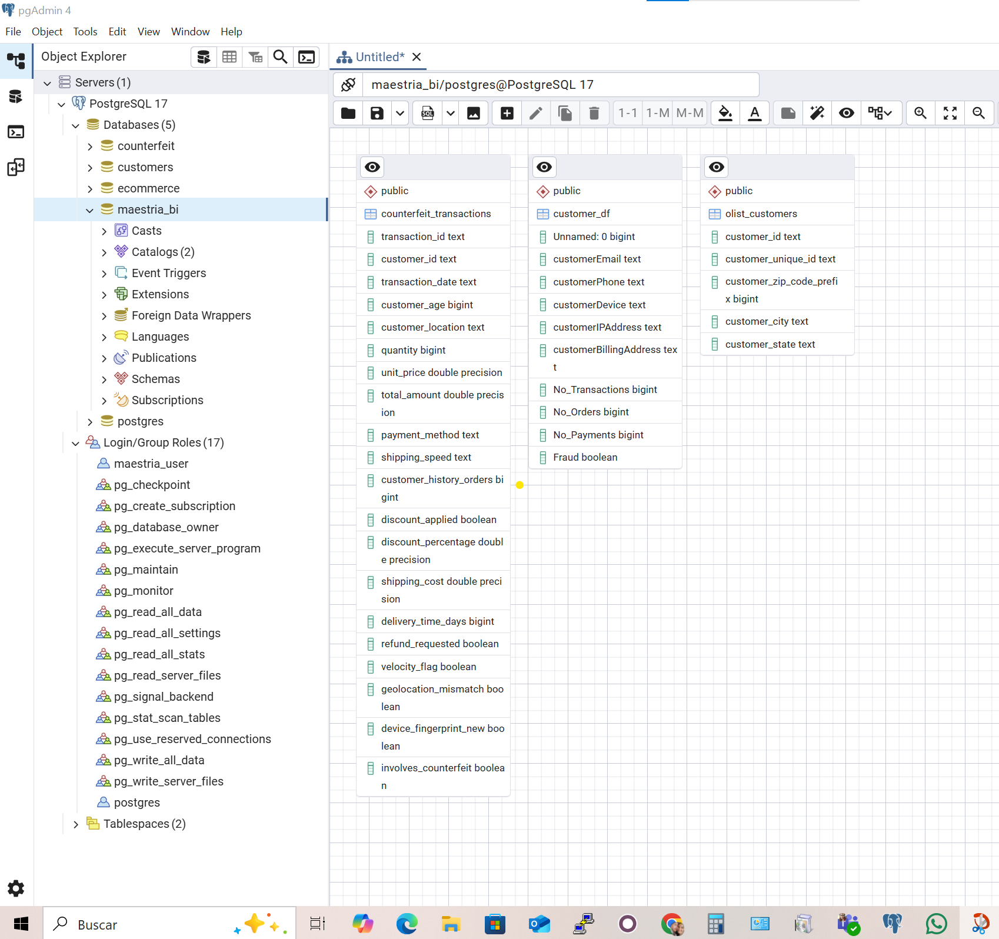
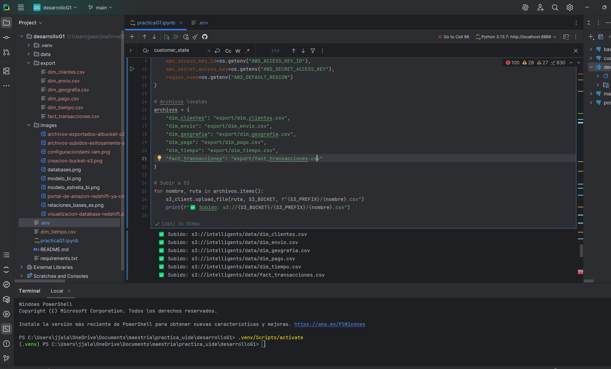

# 🛡️ Proyecto BI – Inteligencia de Negocios

Este proyecto integra **tres fuentes de datos distintas**, cada una cargada en **PostgreSQL** y analizada con **Python (pandas, SQLAlchemy, Jupyter)**.  
El objetivo es construir **DataFrames principales** para exploración, aplicar filtros representativos y generar valor de negocio a partir de los datos.


## 📂 1. Counterfeit Product Detection Dataset

**Fuente:** Kaggle – [Counterfeit Product Detection](https://www.kaggle.com/datasets/aimlveera/counterfeit-product-detection-dataset)  
**Tabla en PostgreSQL:** `counterfeit_transactions`

### DataFrames principales
- **Transacciones (`df_transacciones`)**  
  Variables: `transaction_id`, `transaction_date`, `customer_id`, `quantity`, `unit_price`, `total_amount`, `payment_method`, `shipping_speed`, `discount_applied`, `refund_requested`, `velocity_flag`, `geolocation_mismatch`.  
  - Filtros:
    1. Transacciones de alto valor (top 10%).  
    2. Transacciones con banderas de riesgo.  
    3. Transacciones con descuentos elevados.

- **Clientes (`df_clientes`)**  
  Variables agregadas: `total_pedidos`, `monto_total`, `ticket_promedio`, `tasa_reembolso`, `flags_riesgo`, `customer_location_mas_comun`.  
  - Filtros:
    1. Clientes VIP (top 10% por monto).  
    2. Clientes riesgosos (alto reembolso o banderas de fraude).  
    3. Clientes frecuentes (≥ 5 pedidos).

- **Logística (`df_logistica`)**  
  Variables: `shipping_speed`, `delivery_time_days`, `shipping_cost`, `sla_dias`, `cumple_sla`.  
  - Filtros:
    1. Envíos fuera de SLA.  
    2. Envíos costosos (top 10%).  
    3. Envíos lentos (≥ 10 días).


## 📂 2. Olist Customers Dataset

**Fuente:** Kaggle – [Brazilian E-Commerce Public Dataset by Olist](https://www.kaggle.com/datasets/olistbr/brazilian-ecommerce)  
**Tabla en PostgreSQL:** `olist_customers`

### DataFrames principales
- **Clientes (`df_clientes`)**  
  Variables: `customer_id`, `customer_unique_id`, `customer_zip_code_prefix`.  
  - Filtros:
    1. Clientes únicos por `customer_unique_id`.  
    2. Clientes con ZIP > 90000.  
    3. Clientes duplicados en `customer_id`.

- **Ubicaciones (`df_ubicaciones`)**  
  Variables: `customer_city`, `customer_state`.  
  - Filtros:
    1. Clientes de São Paulo (`SP`).  
    2. Clientes de las 10 ciudades más frecuentes.  
    3. Clientes fuera de SP y RJ.

- **Identificadores (`df_identificadores`)**  
  Variables: `customer_id`, `customer_unique_id`.  
  - Filtros:
    1. Conteo de IDs únicos.  
    2. Duplicados en `customer_unique_id`.  
    3. Top 10 IDs más repetidos.


## 📂 3. Customer_DF Dataset

**Fuente:** Dataset académico de fraude en clientes.  
**Tabla en PostgreSQL:** `customer_df`

### DataFrames principales
- **Contacto (`df_contacto`)**  
  Variables: `customerEmail`, `customerPhone`, `customerDevice`, `customerIPAddress`.  
  - Filtros:
    1. Emails con dominio `gmail.com`.  
    2. Dispositivos móviles.  
    3. IPs duplicadas.

- **Transacciones (`df_transacciones`)**  
  Variables: `No_Transactions`, `No_Orders`, `No_Payments`.  
  - Filtros:
    1. Clientes con > 5 transacciones.  
    2. Clientes con > 3 órdenes.  
    3. Clientes con 0 pagos.

- **Riesgo (`df_riesgo`)**  
  Variables: `customerBillingAddress`, `No_Transactions`, `Fraud`.  
  - Filtros:
    1. Clientes marcados como fraude.  
    2. Direcciones de facturación duplicadas.  
    3. Clientes con fraude y más de 2 transacciones.


## ✅ Conclusiones Generales

- **Counterfeit** → Permite detectar fraude en transacciones y optimizar logística.  
- **Olist** → Centrado en datos de clientes, útil para segmentación y geografía.  
- **Customer_DF** → Enfocado en fraude por contacto/dispositivo, muy útil en ciberseguridad.  

Este ecosistema de bases de datos brinda un **pipeline completo de BI**, cubriendo **transacciones, clientes y riesgo** desde múltiples fuentes.


## 🚀 Tecnologías utilizadas
- **PostgreSQL + Docker** → Almacenamiento relacional.  
- **Python (pandas, SQLAlchemy)** → Procesamiento de datos.  
- **Jupyter / DataSpell** → Exploración y documentación.  
- **Kaggle + datasets académicos** → Fuentes de datos abiertas.


### Taller No.2 

# 📘 ProyectoG1 – Componente Práctico S2

## 📌 Introducción
Este proyecto corresponde al **Componente Práctico S2** de la materia **Inteligencia de Negocios**.  
El objetivo principal fue **preparar y transformar datos de diferentes fuentes** para dejarlos listos para análisis, aplicando técnicas de **Exploración, Limpieza, Transformación y Expansión de DataFrames**.

En la práctica profesional, los datos rara vez llegan limpios: suelen contener errores, duplicados o formatos inconsistentes.  
Por eso, aplicamos un proceso **ETL (Extract, Transform, Load)**:

- **Extract (Extracción):** obtuvimos datos desde CSV y los cargamos en PostgreSQL.  
- **Transform (Transformación):** limpiamos, normalizamos y derivamos nuevas variables.  
- **Load (Carga):** guardamos las tablas listas en la base `maestria_bi`.  


## 🗂️ Fuentes de datos
Se trabajó con tres datasets principales:

1. **`counterfeit_transactions`**  
   - Contiene transacciones con información de fechas, montos, métodos de pago y banderas de fraude.  

2. **`customer_df`**  
   - Incluye información de clientes: correo, teléfono, IP, dirección de facturación y comportamiento histórico.  

3. **`olist_customers_dataset`**  
   - Proporciona identificadores de clientes junto con ubicación geográfica (código postal, ciudad, estado).  


## ⚙️ Desarrollo del Taller

### a. Exploración inicial
- Se identificaron columnas, registros y llaves candidatas (`transaction_id`, `customer_id`).  
- Descubrimos que `customer_df` no tenía `customer_id`, por lo que se generó un identificador artificial.

👉 **Utilidad:** reconocer cómo se relacionan los datasets y detectar problemas de calidad.


### b. Limpieza de datos
- Normalizamos nombres de columnas (`snake_case`).  
- Eliminamos duplicados.  
- Quitamos valores nulos en campos clave.  

👉 **Utilidad:** garantizar consistencia y evitar errores en análisis posteriores.


### c. Variables de entorno
Se creó un archivo **`.env`** con las credenciales de conexión a PostgreSQL.  

👉 **Utilidad:** proteger contraseñas y buenas prácticas de seguridad.


### d. Transformaciones
Aplicamos transformaciones relevantes:  
- **Transacciones:** derivamos `anio` y `mes` desde `transaction_date`.  
- **Clientes:** creamos `longitud_email` usando funciones `lambda`.  
- **Olist:** normalizamos `customer_city` y `customer_state`.  

👉 **Utilidad:** enriquecer los datos para análisis temporal, validación y segmentación.


### e. Expansión de DataFrames
Las nuevas variables fueron integradas en los DataFrames originales.  

👉 **Utilidad:** mantener datasets completos y listos para consultas.


### f. Índices numéricos
Se generaron IDs únicos y secuenciales:  
- `id_transaccion`  
- `id_cliente`  
- `id_olist`  

👉 **Utilidad:** asegurar integridad referencial y facilitar cruces en SQL.


## 📊 Visualización de resultados

Con los datos ya listos, construimos gráficas para extraer información:

1. **Distribución de montos de transacciones**  
   Permite detectar clientes con montos atípicamente altos o bajos.  

2. **Clientes por estado**  
   Muestra la concentración geográfica de clientes (útil en segmentación de mercado).  

3. **Transacciones por mes/año**  
   Identifica tendencias estacionales y patrones de compra.  


## 🚀 Utilidad del proyecto
- Integración de datos heterogéneos en una sola base relacional.  
- Aseguramiento de la calidad de los datos para análisis confiables.  
- Creación de indicadores clave (fraude, distribución geográfica, tendencias temporales).  
- Base preparada para **dashboards de BI** o **modelos predictivos**.  


## ✅ Conclusiones
- Los datos crudos no son útiles sin un proceso de limpieza y transformación.  
- La fase **Transformación (T en ETL)** es crucial para dar valor a la información.  
- Ahora contamos con una base de datos **integrada, normalizada y enriquecida**, lista para análisis estratégicos en Inteligencia de Negocios.  


## 👥 Autores
- Equipo G1 – Maestría en Ciberseguridad 
    - ALAVA BOLAÑOS JENNY JULIZZA
    - MUÑOZ SARMIENTO ANDERSON JOEL
    - ORDOÑEZ VIVANCO MARIA FERNANDA

# 📘 ProyectoG1 – Componente Práctico S2

## 📌 Introducción
Este proyecto corresponde al **Componente Práctico S2** de la materia **Inteligencia de Negocios**.  
El objetivo principal fue **preparar y transformar datos de diferentes fuentes** para dejarlos listos para análisis, aplicando técnicas de **Exploración, Limpieza, Transformación y Expansión de DataFrames**.

En la práctica profesional, los datos rara vez llegan limpios: suelen contener errores, duplicados o formatos inconsistentes.  
Por eso, aplicamos un proceso **ETL (Extract, Transform, Load)**:

- **Extract (Extracción):** obtuvimos datos desde CSV y los cargamos en PostgreSQL.  
- **Transform (Transformación):** limpiamos, normalizamos y derivamos nuevas variables.  
- **Load (Carga):** guardamos las tablas listas en la base `maestria_bi`.  


## 🗂️ Fuentes de datos
Se trabajó con tres datasets principales:

1. **`counterfeit_transactions`**  
   - Contiene transacciones con información de fechas, montos, métodos de pago y banderas de fraude.  

2. **`customer_df`**  
   - Incluye información de clientes: correo, teléfono, IP, dirección de facturación y comportamiento histórico.  

3. **`olist_customers_dataset`**  
   - Proporciona identificadores de clientes junto con ubicación geográfica (código postal, ciudad, estado).  


## ⚙️ Desarrollo del Taller

### a. Exploración inicial
- Se identificaron columnas, registros y llaves candidatas (`transaction_id`, `customer_id`).  
- Descubrimos que `customer_df` no tenía `customer_id`, por lo que se generó un identificador artificial.

👉 **Utilidad:** reconocer cómo se relacionan los datasets y detectar problemas de calidad.


### b. Limpieza de datos
- Normalizamos nombres de columnas (`snake_case`).  
- Eliminamos duplicados.  
- Quitamos valores nulos en campos clave.  

👉 **Utilidad:** garantizar consistencia y evitar errores en análisis posteriores.


### c. Variables de entorno
Se creó un archivo **`.env`** con las credenciales de conexión a PostgreSQL.  

👉 **Utilidad:** proteger contraseñas y buenas prácticas de seguridad.


### d. Transformaciones
Aplicamos transformaciones relevantes:  
- **Transacciones:** derivamos `anio` y `mes` desde `transaction_date`.  
- **Clientes:** creamos `longitud_email` usando funciones `lambda`.  
- **Olist:** normalizamos `customer_city` y `customer_state`.  

👉 **Utilidad:** enriquecer los datos para análisis temporal, validación y segmentación.

### e. Expansión de DataFrames
Las nuevas variables fueron integradas en los DataFrames originales.  

👉 **Utilidad:** mantener datasets completos y listos para consultas.


### f. Índices numéricos
Se generaron IDs únicos y secuenciales:  
- `id_transaccion`  
- `id_cliente`  
- `id_olist`  

👉 **Utilidad:** asegurar integridad referencial y facilitar cruces en SQL.


## 📊 Visualización de resultados

Con los datos ya listos, construimos gráficas para extraer información:

1. **Distribución de montos de transacciones**  
   Permite detectar clientes con montos atípicamente altos o bajos.  

2. **Clientes por estado**  
   Muestra la concentración geográfica de clientes (útil en segmentación de mercado).  

3. **Transacciones por mes/año**  
   Identifica tendencias estacionales y patrones de compra.  


## 🚀 Utilidad del proyecto
- Integración de datos heterogéneos en una sola base relacional.  
- Aseguramiento de la calidad de los datos para análisis confiables.  
- Creación de indicadores clave (fraude, distribución geográfica, tendencias temporales).  
- Base preparada para **dashboards de BI** o **modelos predictivos**.  


## ✅ Conclusiones
- Los datos crudos no son útiles sin un proceso de limpieza y transformación.  
- La fase **Transformación (T en ETL)** es crucial para dar valor a la información.  
- Ahora contamos con una base de datos **integrada, normalizada y enriquecida**, lista para análisis estratégicos en Inteligencia de Negocios.  


# 📊 Práctica 3 — Integración de Datos con Redshift y S3

Este proyecto corresponde a la **Práctica 3 de la Maestría en Ciberseguridad y BI (UIDE)**.  
El objetivo fue **crear un Data Warehouse en Amazon Redshift**, cargando datos desde archivos CSV en Amazon S3, para luego realizar consultas analíticas.

---

## 🚀 Pasos Realizados

### 1️⃣ Preparación del Entorno
- Se configuraron credenciales de **AWS IAM** con permisos sobre S3 y Redshift.
- Se creó un **bucket S3** llamado: `intelligents`.
- Se habilitó un **workgroup Redshift Serverless** (`uide-workgroup`) y un **namespace** (`redshift-uide`).

📸 **Evidencia:**  
-   
-   
-   

---

### 2️⃣ Exportación y Subida de Datos
- Se exportaron los dataframes de la práctica en **archivos CSV**.  
- Archivos generados:
  - `dim_clientes.csv`
  - `dim_envio.csv`
  - `dim_geografia.csv`
  - `dim_pago.csv`
  - `dim_tiempo.csv`
  - `fact_transacciones.csv`
- Los CSV fueron subidos exitosamente a **S3** en la carpeta `data/`.

📸 **Evidencia:**  
-   
-   

---

### 3️⃣ Creación de Tablas en Redshift
- Se conectó Python (PyCharm / Jupyter) con Redshift usando `psycopg2`.  
- Se ejecutaron scripts SQL para crear las tablas dimensionales y de hechos:  
  - `dim_clientes`  
  - `dim_envio`  
  - `dim_geografia`  
  - `dim_pago`  
  - `dim_tiempo`  
  - `fact_transacciones`

📸 **Evidencia:**  
-   
-   

---

### 4️⃣ Carga de Datos con COPY desde S3
- Se configuró un **IAM Role** (`RedshiftS3AccessRole`) con permisos de `AmazonS3FullAccess`.
- Se usó el comando `COPY` para cargar los datos desde los archivos CSV en S3 a las tablas en Redshift.

📸 **Evidencia:**  
-   
-   

---

### 5️⃣ Validación y Consultas
- Se verificó el conteo de registros por tabla en Redshift:  

```sql
SELECT 'dim_tiempo', COUNT(*) FROM dim_tiempo
UNION ALL
SELECT 'dim_clientes', COUNT(*) FROM dim_clientes
UNION ALL
SELECT 'dim_geografia', COUNT(*) FROM dim_geografia
UNION ALL
SELECT 'dim_pago', COUNT(*) FROM dim_pago
UNION ALL
SELECT 'dim_envio', COUNT(*) FROM dim_envio
UNION ALL
SELECT 'fact_transacciones', COUNT(*) FROM fact_transacciones;

## 👥 Autores
- Equipo G1 – Maestría en Ciberseguridad 
  * ORDOÑEZ VIVANCO MARIA FERNANDA
  * MUÑOZ SARMIENTO ANDERSON JOEL
  * ALAVA BOLAÑOS JENNY JULIZZA

- Universidad Internacional del Ecuador (UIDE)  
